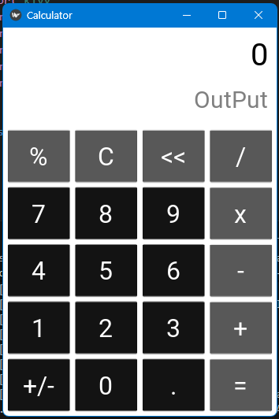

# Kivy Calculator

**Author:** Priyanshu (*YiralcrafT*)

## Reason for Using Python and Kivy

This calculator was built a few months ago when I was learning Python and exploring application development for the first time. At that stage, using Python with Kivy was the most practical choice because I was already familiar with Python and wanted a simple way to create graphical applications.

I was aware that Python and Kivy are not the standard tools for Android app development. However, learning Python, Java/Kotlin, Android SDK, and XML all at once felt overwhelming for a beginner. Kivy allowed me to focus on programming concepts, UI design, and application logic without having to learn an entirely new development stack.

Today, as I am publishing this project on GitHub, my skills have grown significantly. I have learned Java and Android development and am now building native Android applications. Looking back, this calculator represents an important step in my learning journey. While the implementation may not be the most efficient by current standards, it reflects the knowledge, curiosity, and problem-solving skills I had at that point in time.

I have chosen to keep this project public because it showcases my progress as a developer—from building simple desktop applications with Python and Kivy to creating native Android applications with Java.


## Features

- Addition
- Subtraction
- Multiplication
- Division
- Modulus
- Decimal support
- Modern UI

## Technologies Used

- Python
- Kivy

## Installation

```bash
pip install -r requirements.txt
python main.py
```

## Screenshot

